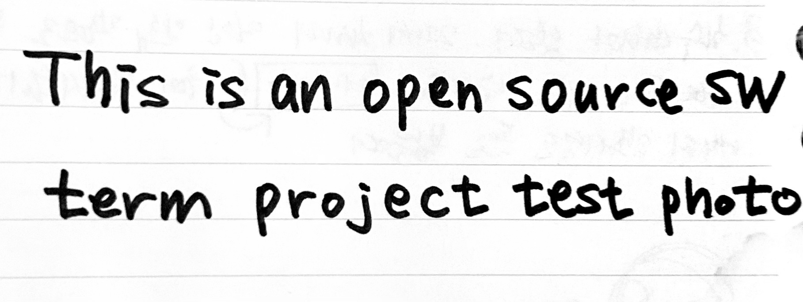
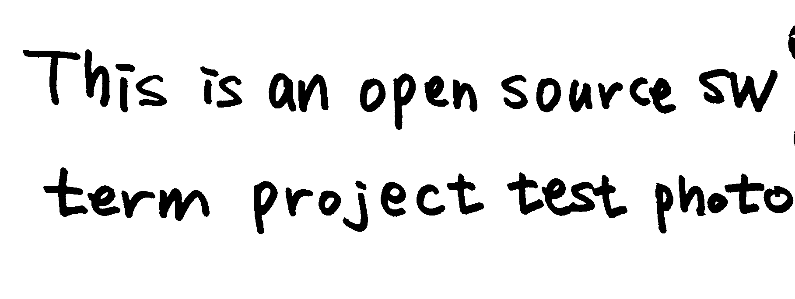
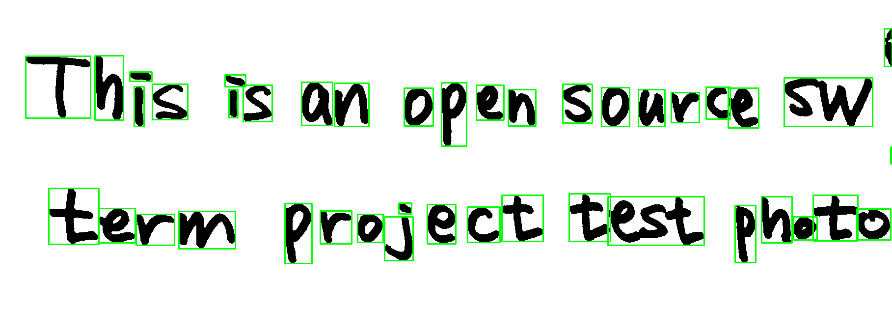

# Convert handwriting to text file with OpenCV
### _Open Source SW Termproject, Team-Wedge Potato_
---
## Project outline
1. Steps involved: 
    i. Black and white conversion
    - Converts a color image to a black and white image.
    - Python module: Uses **OpenCV**'s **cv2.cvtColor()** function.

    ii. Binarization
    - Converts an image to black and white, then binarizes pixels to 0 or 255 based on a threshold.
    - Python module: Uses **OpenCV**'s **cv2.threshold()** function.
    
    iii.Split text area
    - Finds and isolates areas of text in an image.
    - Python module: Uses **OpenCV**'s **cv2.findContours()** function.

    iv.Save text
    - Converts separated characters into text and saves them as a text file.
    - Python module: Extract text using **EasyOCR**, a Python package that allows you to easily perform character area detection and character recognition. To save the extracted text in a file, use the **open()** function that is a basic module of Python.
---

## Requirements: (with versions i tested on)
1. python (3.7.4)
2. opencv-python (4.8.1.78)
3. easyocr (1.7.1)

## Installation

```sh
$ pip install opencv-python
```
```sh
$ pip install easyocr
```
For production environments...

```sh
npm install --production
NODE_ENV=production node app
```

---
## How to run

Use or utilize "convert.py" from the final branch(default branch).
In the code of input_image = './image/test.jpg', modify the image path to suit each case and run it.

```sh
input_image = 'Path of the photo you want to convert'
```
---
## Result

1. Black and white conversion


2. Binarization


3. Split text area


4. Save text


